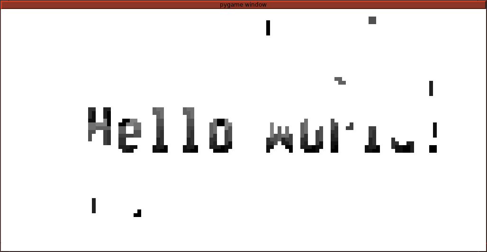

Tetris Scroller

Inspired by

https://github.com/toblum/TetrisAnimation
https://github.com/toblum/esp_p10_tetris_clock

Unlike the original this library computes the tiling on the fly and while 
it is primarily intended to be used with this font

https://www.wfonts.com/font/atari-st-8x16-system-font
https://www.wfonts.com/download/data/2014/06/09/atari-st-8x16-system-font/AtariST8x16SystemFont.ttf

it may work work other fonts (with small adjustments)

sudo ./tetris_animation.py  --led-cols=64  --led-rows=64  --led-slowdown-gpio=2  --led-chain=2 --text="Hello World!"

Configuration

two 64x64 pannels]

